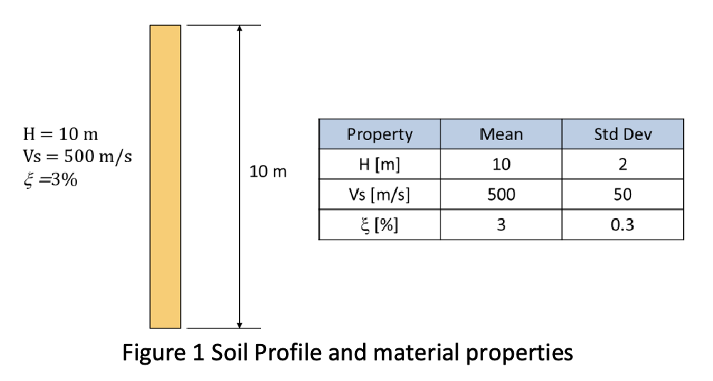

.. _case_2:

EEUQ - Transfer Function and Uncertainty
================================

Author: Erick Martinez
----------------------

Introduction
------------

This page describes the basic concept of transfer functions and their use in a site response analysis. Along with this, the uncertainty in this process will be explained. For more details, the user is encouraged to read :cite:`Kramer1996`. 

Problem Description
-------------------

A transfer function acts as a filter that can amplify or de-amplify an incoming wave from a medium to produce the output signal in another medium. To simplify the idea of a transfer function, a spring-mass system can be used. As a motion is applied on the mass connected to a spring; a responsive outgoing wave will then be propagated through the mass and the spring. This outgoing motion will be a composite factor of the stiffness and elastic damping forces found within the spring-mass system. 

This can be applied to earth systems in the form of ground motions. An example of this is an earthquake motion acting on a rock layer at a certain depth. This motion is then transferred through the soil profile and is reflected as a different motion at the surface. In order to determine the influence of a soil profile on the motion, three major components are required: thickness of layer (H), shear wave velocity (Vs), and damping ratio. As with any engineering properties, there will always be the presence of uncertainty. A layer might have differential thicknesses in certain regions, causing the height to be non-uniform. Shear wave velocity can change very quickly depending on depth and composition of the materials within the layer. Damping can also be affected by changes in stratigraphy and composition. To account for this, uncertainty must be incorporated into a transfer function analysis. This inclusion will aid in the accuracy and reliability of site response analyses. 

Solution Strategy
-----------------

In earth systems, this relationship between incoming and outgoing wave can be evaluated through mathematically converting an input motion, typically an acceleration-time history, to a Fourier series. In the Fourier space, the motion is then multiplied by the transfer function, resulting in the outgoing Fourier motion. This can then be converted back into various plots, such as acceleration-time history and spectral acceleration vs. period, that allow for analysis of the outgoing motion. An analysis of this ground motion can provide frequencies of interest where ground accelerations would be highest/lowest, which can aid in site response analysis and planning. 

	
.. figure:: ./images/TF_Rock_to_Soil1.png
    :scale: 30 %
    :align: center
    :figclass: align-center

NEEDS FINISHING

SimCenter Tool Used
-------------------

To understand transfer functions, there are many tools available. One of these tools is the SimCenter Transfer Function Tool (TFT). This tool introduces users to transfer functions by providing the output motion at a site given the motion, thickness of layers, shear wave velocities, and damping ratio. TFT allows for easy analysis of amplification/de-amplification of ground motions based on specific sites.

The Earthquake Engineering with Uncertainty Quantification Application (EE-UQ) is a SimCenter research application that also allows for site response predictions due to earthquake loading. In addition to basic transfer function quantification, it allows for the analysis of uncertainty in the predictions based on the uncertainty found within the input model, motion, etc. This workflow application allows the user to run analyses in the background and provides a simple user interface that facilitates its use.

Example Application
-------------------

For our purposes, an earthquake motion will be applied to a rock, located at the bottom of a one-dimensional soil profile. In this example, we will analyze the amplification/deamplification effects of the ground motion caused by its propagation through the soil layer. The 10 meter soil layer has a shear wave velocity (Vs) of 500 m/s and a damping ratio of 3%.

	

Because of the presence of uncertainty in the soil properties, the transfer function will include uncertainty in its effects. Normal distribution values for each variable (H, Vs, damping) will be provided.This uncertainty will be quantified through multiple runs in EE-UQ and expressed as ratios of mean velocity and acceleration, along with standard deviation and skewness. 

NEEDS FINISHING

Remarks
-------

NEEDS FINISHING

.. warning:: 
    Plotting FFT's will slow down the animation speed significantly, especially as the length of the time histories increase.

.. bibliography:: references.bib