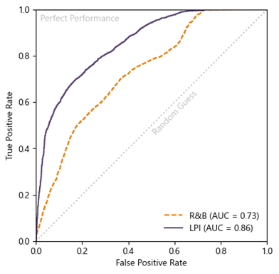
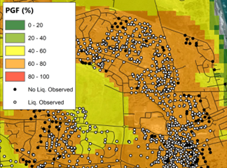

.. _case_5:

R2D - Liquefaction
==================

Author: Morgan Sanger
---------------------

Introduction
------------

This page describes basic concepts of geospatial liquefaction hazard modeling. 

Problem Description
-------------------

Coseismic soil liquefaction is a phenomenon in which the strength and stiffness of a soil is reduced by earthquake shaking. Resilient communities and infrastructure networks, like lifelines or transportation systems, must be built to withstand and respond to hazards posed by coseismic soil liquefaction. Ideally, these predictions could be made:

* quickly, in near-real-time after an event; 

* at high resolution, consistent with the scale of individual assets; and 

* at map-scale, across the regional extent affected by large earthquakes. 

Common liquefaction models in practice require in-situ testing which cannot be continuously performed across large areas, thus presenting the need for “geospatial” liquefaction models. Prior tests of such models (e.g., :cite:`Zhu2017`) have shown both promising potential and severe shortcomings in predicting subsurface conditions with few geospatial predictors. There is a need to advance geospatial liquefaction modeling by integrating geotechnical data, liquefaction mechanics, artificial intelligence (AI), and many geospatial predictor variables to provide reliable regional liquefaction predictions for any earthquake event. When integrated with regional hazard assessment capabilities, geospatial liquefcation models will provide value throughout the life of infrastructure projects - from initial desk studies to refined project-specific hazard analyses - and will unlock insights beyond conventional practice, with opportunity to: 

* prescribe event-specific emergency response and evacuation routes immediately after an earthquake,

* evaluate network reliability and infrastructure network resiliency using structural databases or other asset inventories, and 

* understand the impacts of earthquake events of vulnerable communities using population demographic data. 

Solution Strategy
-----------------

The state-of-practice geospatial liquefaction model is the :cite:`RB2020` model (updated version of the :cite:`Zhu2017` model), which uses logistic regression to predict probability of liquefaction based on five (5) geospatial variables and trained on a database of liquefaction case histories.

In this problem, another modeling solution strategy is proposed, according to :cite:`Sanger2024`. The :cite:`Sanger2024` approach parses the problem into that which is empirical and best predicted by AI (the relationship between geospatial variables and subsurface traits) and that which is best predicted by mechanics (liquefaction response, conditioned on those traits). In this approach, the subsurface traits are characterized at point locations using available cone penetration testing (CPT) data. The liquefaction response at each CPT location is computed across a range of magnitude-scale peak ground accelerations (PGAM7.5) using state-of-practice liquefaction manifestation models (e.g., liquefaction potential index, LPI), thereby retaining the knowledge of liquefaction mechanics developed over the last 50+ years. The relationship between manifestation index and PGAM7.5 is represented as a functional form (Eqn 1) with two curve-fitting parameters: A and B (Fig 1). Therefore, the liquefaction response (i.e., A and B) at each CPT location becomes target variables of supervised learning AI models.  

.. math::
    MI = \left\{ \begin{array}{ll}
    0, & \text{PGA}_{M7.5} < 0.1g \\
    \arctan(B \cdot (\text{PGA}_{M7.5} - \frac{A}{B})^2) \cdot 100, & \text{PGA}_{M7.5} \geq 0.1g
    \end{array} \right.

**Eqn 1.** Manifestation index as a function of A, B, and PGAM7.5. 

.. figure:: ./images/manifestationcurve.png
    :scale: 100 %
    :align: center
    :figclass: align-center
    
    **Fig 1.** Example manifestation curve of LPI vs. PGAM7.5 for a single CPT.

The AI model is trained to predict liquefaction response from a suite of geospatial predictor variables identified as proxies of liquefaction (37 variables). Example predictor variables include mapped or remotely sensed metrics of surface topography and roughness; distance to and elevation above water bodies; geology, geomorphology, hydrology, and more. By applying the final trained AI model to the full predictor datasets, the A and B parameters are predicted geospatially at a defined resolution. A final, key step of the approach is that AI predictions are geostatistically updated via regression kriging in the vicinity of field measurements, such that nearby predictions are based mostly on known subsurface conditions and have lower model uncertainty, whereas distal predictions are based mostly on AI and have greater model uncertainty. In summary, this approach effectively pre-computes liquefaction response across all possible ground motion intensities and durations based on AI-predicted subsurface conditions. These predictions are stored as mapped parameters, awaiting information about a specific earthquake of interest, real or scenario, such as a PGAM7.5 raster from R2D.  

Model predictions were then tested against the leading geospatial model :cite:`RB2020` in three case-history events using receiver operating characteristic and area under the curve analyses (Fig 2). The :cite:`Sanger2024` AI model (before kriging) performed significantly better than :cite:`RB2020` and was further improved by kriging (Fig 3). 

    **Fig 2.** Receiver operator characteristic curves and area under the curve (AUC) analyses comparing :cite:`RB2020` (“R&B”), and the :cite:`Sanger2024` *before* regression kriging (“LPI”).

.. figure:: ./images/zhu2017.png
    :scale: 100 %
    :align: center
    :figclass: align-center

    **(a)**

    **(b)**

.. figure:: ./images/sanger2024-krig.png
    :scale: 100 %
    :align: center
    :figclass: align-center

    **(c)**

    **Fig 3.** Comparison between **(a)** Rashidian & Baise (2020), and this model **(b)** before and **(c)** after regression kriging for the Feb. 2011 M6.1 Christchurch event.

SimCenter Tool Used
-------------------

The presented problem can be solved using SimCenter's Regional Resilience Determination `R2D <https://simcenter.designsafe-ci.org/research-tools/r2dtool/>`_ Tool. A substantially complete description of the tool is provided in the `R2D Documentation <https://nheri-simcenter.github.io/R2D-Documentation/common/user_manual/about/R2D/about.html>`_. 

The :cite:`Zhu2017` model is implemented in the R2D tool (version 4.2.0), whereas the :cite:`Sanger2024` model is not yet implemented in the R2D tool. In this project, the :cite:`Sanger2024` model was implemented in the R2D tool using Python applications file. 

Example Application
-------------------

Remarks
-------

* To adjust the **plotting scales**, use the small expansion/contraction triangular buttons on the plot for the horizontal scale, and the plot scale buttons on the `Scale Button Toolbar <#scaling-buttons>`_ for the vertical scale. 

.. note::
    You will notice that all plots scale together. This is so that plots of a given type can be compared visually without any misleading differences in scale factors.

* To adjust the **horizontal offset** of a plot, click in the plot and drag horizontally to scroll back and forth.

.. note::
    In general, plots will automatically scroll as necessary as time is running. Once you have manually scrolled a plot, though, the automatic scrolling will cease until time is reset to zero.

* Plot boxes can be added or removed at any time, but they only accumulate data beginning from the time they are installed, with the exception of FFT plots, which always plot the according to the data accumulated in the target time history. FFT plots can use up to the first 1024 points in a time history.

.. warning:: 
    Plotting FFT's will slow down the animation speed significantly, especially as the length of the time histories increase.

.. bibliography:: references.bib